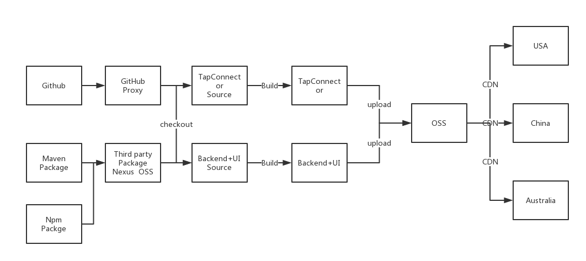

# 项目的快速构建流程

## 概览



## Nexus Repository Manager OSS

- Store and distribute Maven/Java, npm, NuGet, RubyGems, Docker, P2, OBR, APT and YUM and more.
- Manage components from dev through delivery: binaries, containers, assemblies, and finished goods.
- Awesome support for the Java Virtual Machine (JVM) ecosystem, including Gradle, Ant, Maven, and Ivy.
- Compatible with popular tools like Eclipse, IntelliJ, Hudson, Jenkins, Puppet, Chef, Docker, and more.

## GitHub Proxy

- Vultr 供应商

```shell
➜  Downloads scp jdk-8u172-ea-bin-b03-linux-x64-18_jan_2018.tar.gz root@ss3:
jdk-8u172-ea-bin-b03-linux-x64-18_jan_2018.tar.gz      100%  129MB   1.8MB/s   01:14
```
- 速度比现有的lax服务器快

- 创建一个公共的github帐号

## Build

1 不基于Docker

- 在宿主机上构建TapConnector,Backend+Frontend可执行文件

2 基于 Docker

- 构建为不同的镜像

## OSS+CDN (Qiniu)

- 不错的速度
- 部分流量免费
