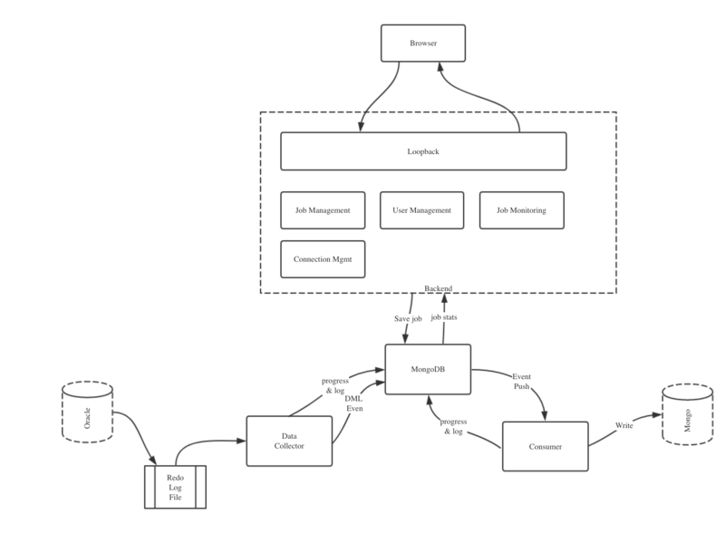
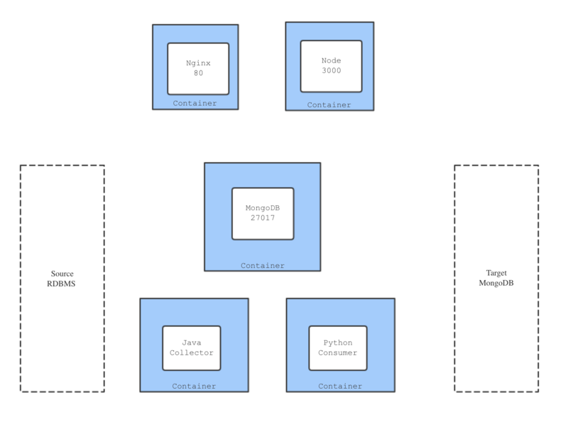

##系统架构图

  

##  部署架构图
  


## 需求
- 能够在一键快速从头开始部署业务系统所有模块，包括web，mongo，python和java
- 能够在不改动数据库的情况下进行升级部署
- 能够单独对某一个模块重新部署
- 提供部署的文档说明，为下一步自动化做准备


## Prepare
### Yarn
```shell
curl -sS https://dl.yarnpkg.com/debian/pubkey.gpg | sudo apt-key add -
echo "deb https://dl.yarnpkg.com/debian/ stable main" | sudo tee /etc/apt/sources.list.d/yarn.list
```

### Mongodb
```shell
sudo apt-key adv --keyserver hkp://keyserver.ubuntu.com:80 --recv 0C49F3730359A14518585931BC711F9BA15703C6
echo "deb [ arch=amd64,arm64 ] http://repo.mongodb.org/apt/ubuntu xenial/mongodb-org/3.4 multiverse" | sudo tee /etc/apt/sources.list.d/mongodb-org-3.4.list
```

### Node.js
```shell
curl -sL https://deb.nodesource.com/setup_8.x | sudo -E bash -
sudo apt-get install -y nodejs nginx mongodb-org
```


### Update and Install
```shell
sudo apt-get update
sudo apt install yarn nodejs
```

### Global Node.js Modules
```shell
yarn global add pm2
```shell

### Set PATH Env for pm2
```shell
export PATH=$PATH:$HOME/.yarn/bin
```


## Configure

### Create MongoDB View
[查看模型中视图](https://www.teambition.com/project/59d9bb6c00575f4855bef306/posts/post/59ddc15df7f6b426b53266bb)

### Build
```shell
git clone git@github.com:tjworks/daas.git
cd daas/frontend
yarn install && yarn build
cd daas/backend
yarn install

```
### Configure Node.js Backend Connect Mongodb

```
cd daas/backend
vim server/datasources.json  //更改Mongodb连接信息
pm2 start .
```

### Configure Nginx And Restart
```shell
cp  /etc/nginx/conf.d/
vim daas.conf
```

```nginx
server {
  listen 8083;
  root /home/root123/daas/frontend/dist/; ## 注意更改路径
  index index.html index.htm;
  server_name _;
  location / {
    try_files $uri $uri/ =404;
  }
  location /api/ {
    add_header Access-Control-Allow-Origin *;
    proxy_pass http://127.0.0.1:3030/api/;
  }
}
```
```shell
sudo nginx -t
sudo service nginx restart
```